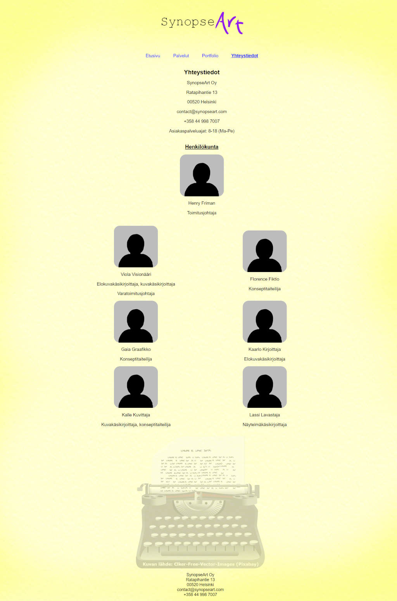

# SynopseArt
A Fictional Web Site Project (made with HTML and CSS)

<!--
*** Thanks for checking out the Best-README-Template. If you have a suggestion
*** that would make this better, please fork the repo and create a pull request
*** or simply open an issue with the tag "enhancement".
*** Don't forget to give the project a star!
*** Thanks again! Now go create something AMAZING! :D
-->

<!-- PROJECT LOGO -->
 

  
 

<h3 align="center">SynopseArt</h3>

  

    My Fictional Website Project
     
    <a href="https://github.com/hffriman/SynopseArt"><strong>Explore the docs »</strong></a>
     
     
    <a href="https://github.com/hffriman/SynopseArt/issues">Report Bug</a>
    ·
    <a href="https://github.com/hffriman/SynopseArt/issues">Request Feature</a>
  

<!-- TABLE OF CONTENTS -->

  
Table of Contents

  <ol>
    <li>
      <a href="#about-the-project">About The Project</a>
      <ul>
        <li><a href="#introduction">Introduction</a></li>
        <li><a href="#screenshots">Screenshots</a></li>
        <li><a href="#built-with">Built With</a></li>
      </ul>
    </li>
    <li><a href="#contact">Contact</a></li>
  </ol>

<!-- ABOUT THE PROJECT -->
## About The Project

### Introduction

SynopseArt, a fictional website for a fictional company, was created by me with HTML and CSS.

This was my individual project in the course "Orientation to Digital Services" during my first year in Haaga-Helia University of Applied Sciences.

The website has 4 pages: Introduction, Services, Portfolio and Staff. It presents a fictional company that creates screenplays, storyboards and concept art for other creative individuals and companies. It also provides consultance, workshops and courses for anyone interested in making films, stage plays or other creative projects of their own.

I created the logo, yellow background and staff images with ArtRage and Gimp. I used HitFilm Express to create the gif animation.

The typewriter is a royalty-free image, provided by Clker-Free-Vector-Images from Pixabay under Pixabay License.

### Screenshots

  

     
  

  

     
  

  

        
  

  

    
  

 
 

### Made With

* HTML
* CSS
* ArtRage
* Gimp
* HitFilm

(<a href="#top">back to top</a>)

<!-- CONTACT -->
## Contact

Henry Friman
  * Twitter: [@hffriman](https://twitter.com/@hfffennec)
  * Mail Adddress: henfriman.second@gmail.com
  * Link to My Profile: [https://github.com/hffriman](https://github.com/hffriman)
  * Link to this project: [https://github.com/hffriman/SynopseArt](https://github.com/hffriman/SynopseArt)

(<a href="#top">back to top</a>)

<!-- ACKNOWLEDGMENTS -->
## Acknowledgments

* The structure of this ReadMe is based on the Best-README-Template:
  * https://github.com/othneildrew/Best-README-Template

* The typewriter in the background is provided by Clker-Free-Vector-Images from Pixabay:
  * https://pixabay.com/fi/vectors/kirjoituskone-vuosikerta-312748/ 

(<a href="#top">back to top</a>)

